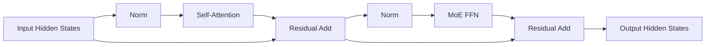
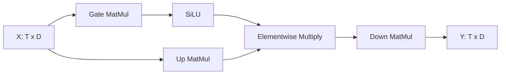
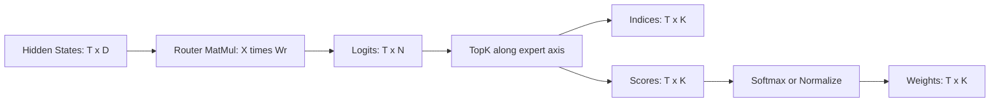
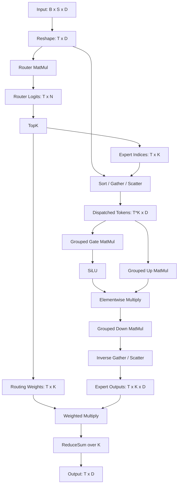
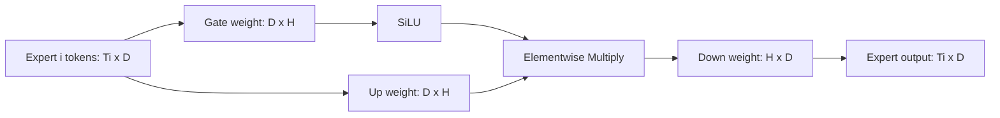
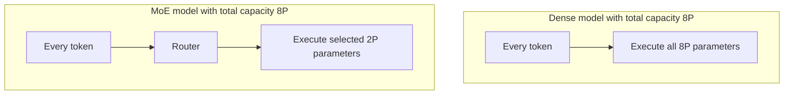
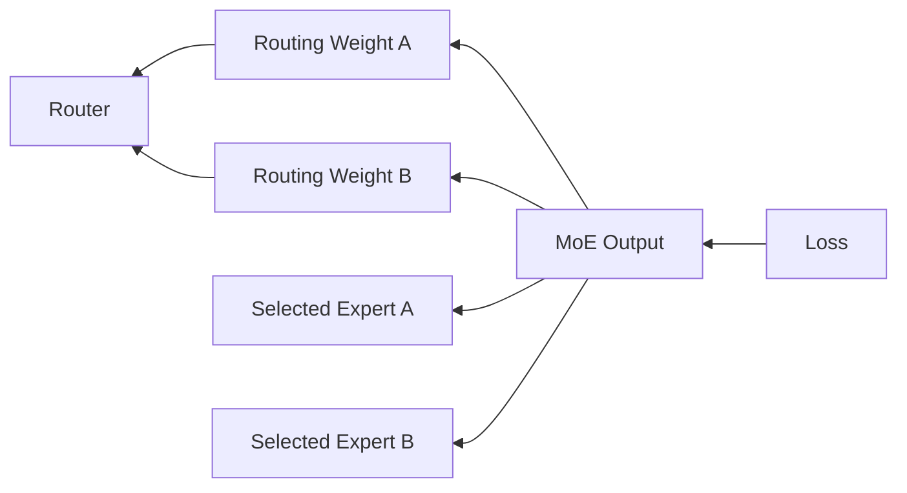
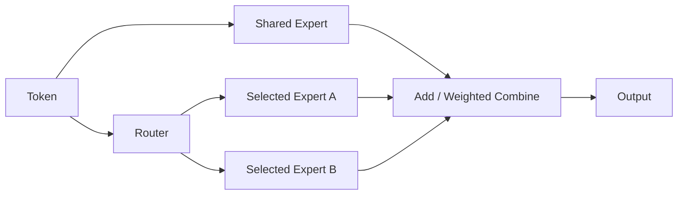
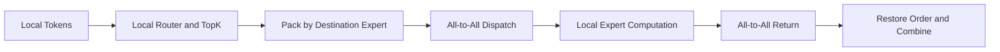

# MoE（Mixture of Experts）完整解析

> 从 Dense FFN 到稀疏专家，从 Router、Top-K、Dispatch、Grouped GEMM 到负载均衡与 Expert Parallelism，系统理解 MoE 的数学原理、算子执行和工程实现。

---

## 目录

1. [先说结论](#一先说结论)
2. [MoE 的发展脉络](#二moe-的发展脉络)
3. [MoE 在 Transformer 中的位置](#三moe-在-transformer-中的位置)
4. [最容易混淆的三个概念](#四最容易混淆的三个概念)
5. [Dense FFN 与 MoE FFN](#五dense-ffn-与-moe-ffn)
6. [Router 如何选择专家](#六router-如何选择专家)
7. [从算子角度看完整前向过程](#七从算子角度看完整前向过程)
8. [一个完整的数值例子](#八一个完整的数值例子)
9. [Token Dispatch 与 Combine](#九token-dispatch-与-combine)
10. [专家内部究竟计算什么](#十专家内部究竟计算什么)
11. [MoE 为什么能扩展模型容量](#十一moe-为什么能扩展模型容量)
12. [容量限制与负载均衡](#十二容量限制与负载均衡)
13. [Router 和专家如何训练](#十三router-和专家如何训练)
14. [主要路由方案](#十四主要路由方案)
15. [共享专家与细粒度专家](#十五共享专家与细粒度专家)
16. [分布式 MoE 与 All-to-All](#十六分布式-moe-与-all-to-all)
17. [Prefill 和 Decode 的性能差异](#十七prefill-和-decode-的性能差异)
18. [编译器与硬件视角](#十八编译器与硬件视角)
19. [训练与部署中的常见问题](#十九训练与部署中的常见问题)
20. [MoE 与相似技术的区别](#二十moe-与相似技术的区别)
21. [常见误区](#二十一常见误区)
22. [总结](#二十二总结)

---

## 一、先说结论

MoE 的核心是**条件计算（Conditional Computation）**：模型拥有很多组专家参数，但每个 Token 只激活其中少数几组。

经典 Transformer MoE 通常只替换 FFN/MLP，Attention 保持不变：

```text
Dense Transformer Block:
    X → Attention → Dense FFN → Y

MoE Transformer Block:
    X → Attention → Router → Top-K Experts → 加权合并 → Y
```

必须先区分以下两件事：

- MoE 通常**不会减少模型的总参数量**，反而会显著增加总参数量。
- MoE 减少的是相对于同等总参数量 Dense 模型的**每 Token 激活参数量和计算量**。

如果一套专家 MLP 有 $P$ 个参数，共有 $N$ 个专家，每个 Token 选择 $K$ 个专家，则忽略 Router 和共享模块后：

$$
P_{\text{total}}=N\cdot P
$$

$$
P_{\text{active per token}}=K\cdot P
$$

专家参数的激活比例约为：

$$
\frac{P_{\text{active}}}{P_{\text{total}}}=\frac{K}{N}
$$

例如 8 个专家、Top-2：模型保存 8 套专家参数，但一个 Token 只经过其中 2 套。

---

## 二、MoE 的发展脉络

MoE 并不是大语言模型时代才出现的概念。

| 时间 | 代表方向 | 关键进展 |
|------|----------|----------|
| 1991-1994 | Adaptive Mixtures of Local Experts | Expert 与 Gating Network 联合训练，形成分工 |
| 2017 | Sparsely-Gated MoE | 使用稀疏 Top-K 路由，将模型扩展到超大规模 |
| 2020 | GShard | 将 MoE、Transformer 与大规模分布式训练结合 |
| 2021 | Switch Transformer | 使用 Top-1 路由简化计算与通信 |
| 2021-2022 | GLaM、ST-MoE、BASE Layers | 改进稳定性、均衡性和扩展能力 |
| 2023-2024 | Mixtral、DBRX、DeepSeekMoE | MoE 成为高性能开源 LLM 的重要路线 |
| 2024 以后 | DeepSeek-V2/V3、Qwen MoE 等 | 共享专家、细粒度专家、无辅助损失均衡与通信优化 |

早期 MoE 可以由多个完整模型组成；现代 LLM 中的 MoE 通常是指 **Transformer 内部的稀疏 FFN 层**。

---

## 三、MoE 在 Transformer 中的位置

一个 Pre-Norm Decoder Transformer Block 可简化为：

$$
H=X+\mathrm{Attention}(\mathrm{Norm}(X))
$$

$$
Y=H+\mathrm{FFN}(\mathrm{Norm}(H))
$$

MoE 一般只将第二个公式中的 FFN 替换为 MoE：

$$
Y=H+\mathrm{MoE}(\mathrm{Norm}(H))
$$



因此，经典 FFN-MoE 中：

- Q/K/V Projection、Attention Score、Softmax 和 KV-Cache 机制通常不变；
- 被替换的是 Dense FFN；
- 也存在 Mixture of Attention、稀疏 Attention 等方案，但它们不是默认意义上的 MoE。

---

## 四、最容易混淆的三个概念

设：

- Batch Size 为 $B$；
- Sequence Length 为 $S$；
- Token 总数为 $T=B\times S$；
- Hidden Size 为 $D$；
- Expert Intermediate Size 为 $H$；
- 专家数量为 $N$；
- 每个 Token 选择的专家数量为 $K$。

它们是不同维度：

| 符号 | 含义 | 示例 |
|------|------|------|
| $T=B\times S$ | 本次需要处理的 Token 数 | 8 |
| $N$ | 模型拥有的专家数 | 4 |
| $K$ | 每个 Token 激活的专家数 | 2 |
| $D$ | Token 隐藏向量宽度 | 4096 |
| $H$ | 每个专家的中间维度 | 11008 |

如果 $T=8$、$N=4$、$K=2$：

- 原始 Token 仍然只有 8 个；
- 模型拥有 4 套专家权重；
- 每个 Token 被送给 2 个专家；
- 总共产生 $T\times K=16$ 个 Token-Expert 计算任务。

```text
Token 数量:       T = 8
专家数量:         N = 4
每 Token 选择数:  K = 2
路由任务数量:     T × K = 16
```

4 个专家不是由 8 个 Token “组成”的。专家是长期保存的模型参数，Token 是每次运行时进入模型的数据。

---

## 五、Dense FFN 与 MoE FFN

### 5.1 Dense SwiGLU FFN

现代 LLM 常用 SwiGLU：

$$
\mathrm{FFN}(X)=
\left(\mathrm{SiLU}(XW_{\text{gate}})\odot XW_{\text{up}}\right)
W_{\text{down}}
$$

权重形状为：

$$
W_{\text{gate}},W_{\text{up}}\in\mathbb{R}^{D\times H},
\qquad
W_{\text{down}}\in\mathbb{R}^{H\times D}
$$



所有 Token 使用同一组权重。

### 5.2 MoE FFN

MoE 保存 $N$ 套不同的 MLP 权重：

```text
Expert 0: Wgate_0, Wup_0, Wdown_0
Expert 1: Wgate_1, Wup_1, Wdown_1
...
Expert N: Wgate_N, Wup_N, Wdown_N
```

可将权重堆叠表示为：

$$
W_{\text{gate}},W_{\text{up}}\in\mathbb{R}^{N\times D\times H}
$$

$$
W_{\text{down}}\in\mathbb{R}^{N\times H\times D}
$$

第 $t$ 个 Token 的输出是：

$$
y_t=\sum_{i\in\mathcal{S}_t}p_{t,i}E_i(x_t)
$$

其中 $\mathcal{S}_t$ 是 Router 为 Token $t$ 选出的 Top-K 专家集合。

### 5.3 参数和计算的正确比较

假设一套专家参数量为 $P$：

| 模型 | 总专家参数 | 每 Token 激活参数 |
|------|------------|--------------------|
| 一套 Dense FFN | $P$ | $P$ |
| 4 专家 Top-1 MoE | $4P$ | $P$ |
| 4 专家 Top-2 MoE | $4P$ | $2P$ |
| 总参数同为 $4P$ 的 Dense FFN | $4P$ | $4P$ |

MoE 的公平比较对象是**同等总参数量的 Dense 模型**。它用稀疏激活避免每个 Token 都执行全部参数。

---

## 六、Router 如何选择专家

### 6.1 Router 输入

Router 接收每个 Token 当前层的隐藏向量：

$$
x_t\in\mathbb{R}^{D}
$$

它不是直接查看 Token ID。相同词语在不同上下文、不同层中的隐藏向量不同，因此可能进入不同专家。

### 6.2 Router 打分

最常见的 Router 是一个小型线性投影：

$$
R=XW_r
$$

其中：

$$
X\in\mathbb{R}^{T\times D},
\quad
W_r\in\mathbb{R}^{D\times N},
\quad
R\in\mathbb{R}^{T\times N}
$$

$R_{t,i}$ 表示 Token $t$ 对专家 $i$ 的路由分数。

### 6.3 Top-K 选择

对每个 Token 在专家维度上执行 Top-K：

$$
\mathcal{S}_t=\mathrm{TopK}(R_t,K)
$$

得到：

```text
expert_indices: [T, K]
expert_scores:  [T, K]
```

### 6.4 路由权重

一种常见方法是只在选中的专家上做 Softmax：

$$
p_{t,i}=
\frac{\exp(R_{t,i})}
{\sum_{j\in\mathcal{S}_t}\exp(R_{t,j})},
\qquad i\in\mathcal{S}_t
$$

也有实现先对全部专家做 Softmax，再取 Top-K。两种方式的数值和梯度并不完全相同，阅读模型实现时需要确认顺序。



---

## 七、从算子角度看完整前向过程

### 7.1 整体计算图



### 7.2 典型算子链

从通用图算子或编译器 IR 看，MoE 通常包含：

```text
Reshape
  → MatMul              # Router
  → Softmax / Sigmoid   # 路由概率，具体方案不同
  → TopK                # 选择专家
  → Sort / Histogram    # 统计并按专家分桶
  → Gather / Scatter    # 重排 Token
  → Grouped MatMul      # 专家 Gate/Up Projection
  → SiLU + Multiply
  → Grouped MatMul      # 专家 Down Projection
  → Inverse Scatter     # 恢复 Token 顺序
  → Multiply            # 乘路由权重
  → ReduceSum           # 合并 Top-K 输出
  → Reshape
  → Residual Add
```

不同框架可能将这些步骤融合成 `MoE`、`FusedMoE`、`GroupedGEMM` 或设备专用算子，语义仍然相同。

---

## 八、一个完整的数值例子

设：

$$
T=4,\quad D=3,\quad N=4,\quad K=2
$$

即有 4 个 Token、隐藏维度为 3、4 个专家，每个 Token 选择 2 个专家。

Router MatMul 得到：

$$
R=
\begin{bmatrix}
2.0 & 0.3 & 1.5 & -0.2\\
0.1 & 2.2 & 0.4 & 1.8\\
1.2 & 0.7 & 2.1 & 0.3\\
0.4 & 1.5 & 0.2 & 2.0
\end{bmatrix}
$$

Top-2 结果为：

| Token | 第一专家 | 第二专家 |
|-------|----------|----------|
| $t_0$ | $E_0$ | $E_2$ |
| $t_1$ | $E_1$ | $E_3$ |
| $t_2$ | $E_2$ | $E_0$ |
| $t_3$ | $E_3$ | $E_1$ |

以 $t_0$ 为例，在两个选中分数上执行 Softmax：

$$
[p_{0,0},p_{0,2}]
=\mathrm{softmax}([2.0,1.5])
\approx[0.622,0.378]
$$

所以：

$$
y_0=0.622E_0(x_0)+0.378E_2(x_0)
$$

Top-2 展开后共有 8 个任务：

```text
(t0, E0)  (t0, E2)
(t1, E1)  (t1, E3)
(t2, E2)  (t2, E0)
(t3, E3)  (t3, E1)
```

按专家排序后：

```text
Expert 0: [t0, t2]
Expert 1: [t1, t3]
Expert 2: [t0, t2]
Expert 3: [t1, t3]
```

此时原始 Token 数仍然是 4，只是产生了 $T\times K=8$ 个专家计算任务。

---

## 九、Token Dispatch 与 Combine

### 9.1 为什么要重排 Token

如果逐 Token 调用专家，会产生大量极小 MatMul：

```text
t0 → Expert 2 MatMul
t1 → Expert 7 MatMul
t2 → Expert 2 MatMul
t3 → Expert 1 MatMul
```

硬件更适合把属于同一专家的 Token 聚集起来，批量执行：

```text
Expert 1 batch: [t3, ...]
Expert 2 batch: [t0, t2, ...]
Expert 7 batch: [t1, ...]
```

### 9.2 Dispatch 的概念实现

```python
# x: [T, D]
# expert_indices: [T, K]
# routing_weights: [T, K]

assignments = []
for token_id in range(T):
    for slot in range(K):
        expert_id = expert_indices[token_id, slot]
        assignments.append((expert_id, token_id, slot))

assignments.sort(key=lambda item: item[0])

for expert_id, token_ids in group_by_expert(assignments):
    expert_input = x[token_ids]
    expert_output = experts[expert_id](expert_input)
```

真实实现不会依赖 Python 循环，而会使用并行的 TopK、Prefix Sum、Sort、Gather、Scatter 或融合 Kernel。

### 9.3 Combine

专家输出需要通过保存的 Token ID 和 Top-K Slot 恢复为：

$$
O\in\mathbb{R}^{T\times K\times D}
$$

再执行：

$$
Y=\mathrm{ReduceSum}_K(O\odot P)
$$

其中：

$$
P\in\mathbb{R}^{T\times K\times1}
$$

```text
专家顺序输出
    ↓ inverse scatter
[T, K, D]
    ↓ multiply [T, K, 1]
加权专家输出
    ↓ reduce_sum(axis=K)
[T, D]
```

---

## 十、专家内部究竟计算什么

每个专家通常是一套完整的 FFN 参数，而不是完整 Transformer，也不包含自己的 Attention 或 KV-Cache。

对专家 $i$：

$$
E_i(X_i)=
\left(
\mathrm{SiLU}(X_iW_{\text{gate},i})
\odot
X_iW_{\text{up},i}
\right)W_{\text{down},i}
$$

其中 $X_i\in\mathbb{R}^{T_i\times D}$，$T_i$ 是本批次分给专家 $i$ 的 Token 数。



不同专家结构一般相同，但参数值不同。训练后它们可能形成不同分工，但不一定能被简单标注为“数学专家”或“代码专家”。专家可能学习的是语法、位置、频率、抽象特征组合等不易解释的模式。

---

## 十一、MoE 为什么能扩展模型容量

### 11.1 参数容量与计算量解耦

Dense 模型若把 FFN 参数从 $P$ 增长到 $8P$，每个 Token 通常都要执行 $8P$ 对应的计算。

8 专家 Top-2 MoE 则是：

```text
总专家参数容量: 8P
每 Token 激活参数: 2P
```



MoE 并非免费获得参数，它把成本从纯计算转移到：

- 权重存储；
- Token 排序与搬运；
- 跨设备通信；
- 动态负载管理；
- 更复杂的训练稳定性控制。

### 11.2 粗略 FLOPs 估算

忽略 Bias 和激活函数，SwiGLU 的三个线性层每 Token 乘加量与 $3DH$ 同阶。

Dense FFN：

$$
C_{\text{dense}}\propto 3TDH
$$

Top-K MoE：

$$
C_{\text{expert}}\propto 3TKDH
$$

还需增加 Router：

$$
C_{\text{router}}\propto TDN
$$

这个公式不能直接说明 MoE 一定比某个 Dense FFN 快，因为 $H$、$K$ 和对比 Dense 模型的中间维度可能不同，而且没有计入 Dispatch 与通信。

---

## 十二、容量限制与负载均衡

### 12.1 Expert Capacity

如果所有 Token 都选择同一个专家，该专家会成为瓶颈。系统常为每个专家设置容量：

$$
C=\left\lceil\frac{T\times K}{N}\times CF\right\rceil
$$

其中 $CF$ 是 Capacity Factor。

例如：

$$
T=1024,\quad K=2,\quad N=8,\quad CF=1.25
$$

则每个专家容量为：

$$
C=\left\lceil\frac{1024\times2}{8}\times1.25\right\rceil=320
$$

超过容量的任务可能：

- 被丢弃并走残差路径；
- 改投次优专家；
- 等待或使用动态容量；
- 通过 Dropless MoE 保证不丢 Token。

### 12.2 为什么会发生专家坍缩

Router 初期稍微偏向某个专家，会形成正反馈：

```text
某专家被选择更多
    → 获得更多训练样本和梯度
    → 更容易降低主任务损失
    → Router 更倾向选择它
```

结果是热门专家过载、冷门专家缺乏训练，称为 Expert Collapse 或 Router Collapse。

### 12.3 辅助负载均衡损失

设：

- $f_i$ 为实际分配给专家 $i$ 的 Token 比例；
- $P_i$ 为 Router 对专家 $i$ 的平均概率；
- $N$ 为专家数。

常见辅助损失形式为：

$$
L_{\text{balance}}=\alpha N\sum_{i=1}^{N}f_iP_i
$$

它鼓励各专家获得接近均匀的负载。

### 12.4 Router Z-Loss

Router logits 过大可能造成 Softmax 饱和和数值不稳定，可加入：

$$
L_z=\beta\left(\log\sum_i\exp(R_i)\right)^2
$$

### 12.5 无辅助损失均衡

辅助损失过强会干扰语言建模目标。另一类方法为每个专家维护动态 Bias：

```text
专家过载 → 降低它的路由 Bias
专家空闲 → 提高它的路由 Bias
```

Bias 用于 Top-K 选择，但可以让用于输出加权的原始路由分数保持不变，从而减少均衡机制对模型质量的直接影响。

---

## 十三、Router 和专家如何训练

### 13.1 梯度路径

对 Top-2 路由：

$$
y_t=p_{t,a}E_a(x_t)+p_{t,b}E_b(x_t)
$$

主任务损失可以通过连续权重 $p_{t,a}$、$p_{t,b}$ 回传到 Router，也能回传到被选中的专家。



### 13.2 Top-K 的离散性

Top-K 返回离散索引，索引变化本身不可用普通梯度直接求导。实践中通常：

- 将选中的专家集合视为当前前向中的固定选择；
- 对选中专家的连续路由权重求导；
- 通过批次中的不同 Token、路由噪声和辅助目标，让其他专家获得训练机会。

### 13.3 哪些参数获得梯度

一次前向中：

- Router 参数获得梯度；
- 被选中的专家获得对应 Token 的梯度；
- 未被任何 Token 选中的专家通常没有本批次主任务梯度；
- Attention、Embedding 等共享参数照常获得梯度。

这也是负载均衡对训练十分重要的原因。

---

## 十四、主要路由方案

### 14.1 Token Choice Top-1

每个 Token 选择一个专家：

$$
i_t=\arg\max_iR_{t,i},\qquad y_t=E_{i_t}(x_t)
$$

优点：计算和通信量低。缺点：缺少第二专家补偿，对路由错误和负载不均更敏感。

### 14.2 Token Choice Top-2 / Top-K

每个 Token 选择多个专家并加权组合：

$$
y_t=\sum_{i\in\mathrm{TopK}(R_t)}p_{t,i}E_i(x_t)
$$

质量和稳定性通常更好，但计算、Token 复制量与通信量更高。

### 14.3 Expert Choice

传统方案是 Token 选择专家；Expert Choice 反过来让每个专家选择固定数量的 Token。

```text
Token Choice:  每个 Token 选择 K 个专家
Expert Choice: 每个专家选择 C 个 Token
```

Expert Choice 天然容易控制负载，但因果推理、动态 Batch 和 Token 覆盖处理更复杂。

### 14.4 Sigmoid Routing

一些模型使用独立 Sigmoid 分数，而不是在全部专家上 Softmax：

$$
s_{t,i}=\sigma(R_{t,i})
$$

然后根据 $s_{t,i}$ 选择 Top-K，并对选中权重归一化。Sigmoid 不强制所有专家在一个概率单纯形中竞争，行为与 Softmax Router 不完全相同。

### 14.5 Group-Limited Routing

大规模集群中，可先选专家组或设备组，再在组内选择专家：

```text
Token
  → 选择少量 Expert Group / Node
  → 在选中组内执行 Top-K
  → 只与少量设备通信
```

它以一定路由自由度换取更低的跨节点通信成本。

---

## 十五、共享专家与细粒度专家

### 15.1 Shared Expert

共享专家处理所有 Token，路由专家只处理被选中的 Token：

$$
y_t=E_{\text{shared}}(x_t)+
\sum_{i\in\mathcal{S}_t}p_{t,i}E_i(x_t)
$$



共享专家学习普遍需要的公共模式，路由专家更专注于差异化模式，从而减少多个专家重复学习公共知识。

### 15.2 Fine-Grained Experts

细粒度 MoE 将一个大专家拆成多个较窄专家。

例如原 Dense FFN 的中间维度为 11008：

```text
Dense FFN: D → 11008 → D
```

MoE 可设计为 8 个中间维度 4096 的专家，每 Token 选 2 个：

```text
Expert i: D → 4096 → D
Active path: 2 × 4096
```

这种设计增加可组合的专家数量，同时控制每 Token 的激活宽度。不能只按专家个数判断计算量，必须同时查看 $H$ 和 $K$。

---

## 十六、分布式 MoE 与 All-to-All

### 16.1 Expert Parallelism

专家数量很大时，通常将不同专家放在不同设备：

```text
GPU 0: Expert 0, Expert 1
GPU 1: Expert 2, Expert 3
GPU 2: Expert 4, Expert 5
GPU 3: Expert 6, Expert 7
```

每张设备最初持有本地 Batch 的 Token。路由后，Token 所需专家可能位于其他设备。



一次 MoE 层通常需要两轮通信：

1. Dispatch All-to-All：将 Token 发给专家所在设备。
2. Return All-to-All：将专家输出送回 Token 原来的设备。

### 16.2 为什么通信可能比计算更贵

每个路由任务至少需要发送和返回一个 $D$ 维隐藏向量。粗略通信数据量与下式同阶：

$$
V_{\text{comm}}\propto 2\times T\times K\times D\times \text{bytes}
$$

这还没有计入索引、对齐与协议开销。跨节点带宽远低于片上带宽，因此大规模 MoE 经常是通信受限，而不是 GEMM 算力受限。

### 16.3 常见优化

- Expert Parallel 与 Tensor Parallel 组合；
- 限制 Token 只选择同节点或少数节点的专家；
- 热门专家复制；
- Dispatch/All-to-All 与本地计算重叠；
- 使用低精度通信；
- 将多个专家 MatMul 合并为 Grouped GEMM；
- 使用连续内存布局，减少 Pack/Unpack 开销。

---

## 十七、Prefill 和 Decode 的性能差异

### 17.1 Prefill

Prefill 一次处理大量 Token：

$$
T=B\times S
$$

每个专家通常能收到足够多的 Token，Grouped GEMM 容易形成较大的矩阵，硬件利用率较高。

### 17.2 Decode

Decode 每个序列每步通常只有一个新 Token：

$$
T=B
$$

当 Batch 较小时，Token 会被分散到多个专家，每个专家可能只收到少量 Token：

```text
Expert 0: 2 tokens
Expert 1: 0 tokens
Expert 2: 1 token
Expert 3: 1 token
```

此时主要问题包括：

- GEMM 的 $M$ 维过小，计算单元利用率低；
- 专家权重读取难以复用；
- Router 和 Dispatch 固定开销占比增大；
- 多设备通信延迟难以隐藏。

所以“激活参数少”不等于“小 Batch Decode 一定快”。MoE 更容易在高并发 Batch、权重常驻设备和高速互联环境中发挥吞吐优势。

---

## 十八、编译器与硬件视角

### 18.1 静态图面临的问题

不同输入会产生不同路由结果，因此每个专家的 $T_i$ 是动态的：

$$
\sum_{i=1}^{N}T_i=T\times K
$$

这给静态图编译带来困难：

- 专家输入形状动态；
- Buffer 大小依赖 Capacity；
- Sort/Scatter 产生不规则访存；
- 不同专家的工作量不均；
- 专家可能跨设备。

### 18.2 Padded Expert Buffer

一种实现为每个专家分配固定容量 $C$：

$$
X_{\text{expert}}\in\mathbb{R}^{N\times C\times D}
$$

优点是形状固定、便于编译；缺点是负载较低时存在 Padding 浪费，溢出时还需要额外策略。

### 18.3 Packed Token Buffer

另一种实现只保存真实任务：

$$
X_{\text{packed}}\in\mathbb{R}^{(T\times K)\times D}
$$

再用 Offset 表示各专家区间：

```text
expert_offsets = [0, T0, T0+T1, ..., T*K]
```

这种布局减少 Padding，但要求运行时和 Kernel 支持动态分段。

### 18.4 Grouped GEMM

各专家输入形状通常不同：

```text
A0[T0, D] × W0[D, H]
A1[T1, D] × W1[D, H]
A2[T2, D] × W2[D, H]
...
```

Grouped GEMM 在一次调度中执行多个独立 MatMul，降低 Kernel Launch 和小矩阵调度开销。它不意味着专家共享权重。

### 18.5 常见融合机会

- Router MatMul + TopK；
- TopK + Histogram + Prefix Sum；
- Dispatch + Layout Conversion；
- Gate MatMul + Up MatMul；
- SiLU + Multiply；
- Expert Output + Routing Weight；
- Inverse Scatter + ReduceSum；
- All-to-All 与本地 Expert GEMM 重叠。

---

## 十九、训练与部署中的常见问题

### 19.1 数值稳定性

Router 对细微排序误差敏感。两个专家分数接近时，低精度误差可能改变 Top-K 索引，因此 Router logits 或 Softmax 常使用 FP32。

### 19.2 专家负载不均

监控指标应至少包括：

- 每个专家接收的 Token 数；
- 最大负载与平均负载比；
- Router 概率熵；
- Capacity 溢出率；
- 未被选择专家比例；
- 各专家梯度范数。

### 19.3 权重显存

稀疏激活不会自动降低权重存储。即使每 Token 只使用两个专家，所有专家权重仍需位于设备、主机内存或可快速交换的存储中。

权重无法常驻显存时，按 Token 动态加载专家通常代价很高。

### 19.4 量化

MoE 权重可以使用 INT8、INT4、FP8 等格式，但需要注意：

- 不同专家的统计分布可能不同；
- 每专家或每通道 Scale 通常比全局 Scale 更准确；
- 小 Batch Decode 更容易受反量化开销影响；
- Router 精度下降可能直接改变专家选择，而不仅是输出产生小误差。

### 19.5 微调

MoE 微调可以：

- 只训练 Router；
- 只训练部分专家；
- 为专家分别添加 LoRA；
- 冻结共享专家，训练路由专家；
- 使用领域数据促进专家专业化。

需要关注冷门专家是否获得足够样本，以及路由分布是否相对预训练发生严重漂移。

---

## 二十、MoE 与相似技术的区别

| 技术 | 选择对象 | 是否模型内部 | 主要目的 |
|------|----------|--------------|----------|
| MoE | Token 选择参数专家 | 是 | 扩大参数容量并控制计算量 |
| Ensemble | 多个完整模型 | 否或外层 | 提高鲁棒性与准确率 |
| RAG | 检索外部文档 | 通常是系统级 | 引入外部知识 |
| Multi-Agent | 多个智能体/模型协作 | 系统级 | 任务分工与推理协作 |
| LoRA | 低秩增量参数 | 是 | 低成本微调 |
| Mixture of LoRA | 动态选择多个 LoRA | 是 | 参数高效的条件适配 |
| Sparse Attention | 选择部分 Token 关系 | 是 | 降低 Attention 复杂度 |
| Mixture of Attention | 路由 Attention 模块 | 是 | 条件化 Attention 计算 |

MoE Expert 通常只是 FFN，不是能独立对话的完整模型，也不等同于多智能体系统。

---

## 二十一、常见误区

### 误区 1：MoE 减少模型总参数

通常相反。MoE 用更多总参数换取更大容量，再通过稀疏路由控制每 Token 计算。

### 误区 2：4 个专家合起来等于 4 个 Token 或 8 个 Token

专家数量 $N$ 与 Token 数量 $T$ 是独立维度。Top-K 后产生的计算任务数才是 $T\times K$。

### 误区 3：每个专家是一整个 Transformer

现代 LLM 的经典 MoE Expert 通常只是一套 FFN 参数；Attention 和其他层仍然共享。

### 误区 4：没有选中的专家参数被删除或不占显存

未选中的专家不参与当前 Token 的计算，但参数仍然需要存储。

### 误区 5：Top-2 表示把两个专家参数拼接成一个大 MLP

不是。两个专家分别计算，再用 Router 权重加权求和：

$$
y=p_1E_1(x)+p_2E_2(x)
$$

### 误区 6：专家一定具有清晰的人类语义

有些专家会表现出领域倾向，但模型学习到的分工经常是复杂的隐空间模式，未必能命名。

### 误区 7：FLOPs 更少就一定延迟更低

实际延迟还包含：

$$
T_{\text{MoE}}=
T_{\text{router}}+
T_{\text{dispatch}}+
T_{\text{communication}}+
T_{\text{expert}}+
T_{\text{combine}}
$$

小 Batch、低速互联或专家权重不能常驻设备时，数据移动成本可能抵消计算收益。

---

## 二十二、总结

MoE 可以用下面这条数据流概括：

$$
\boxed{
X
\xrightarrow{\text{Router MatMul}}
R
\xrightarrow{\text{Top-K}}
(I,P)
\xrightarrow{\text{Dispatch}}
X_E
\xrightarrow{\text{Expert FFN}}
O_E
\xrightarrow{\text{Gather + Weighted Reduce}}
Y
}
$$

从模型角度看：

> MoE 用多个专家扩大参数容量，用 Router 为每个 Token 选择少数计算路径。

从算子角度看：

> MoE 是 Router MatMul、TopK、Token 重排、Grouped GEMM、逆向重排和加权求和组成的动态计算图。

从系统角度看：

> MoE 用更复杂的负载均衡、内存管理和通信调度，换取远大于单 Token 激活规模的总模型容量。

最重要的三个公式是：

$$
\text{Token 数}=T=B\times S
$$

$$
\text{Token-Expert 任务数}=T\times K
$$

$$
\text{专家参数激活比例}\approx\frac{K}{N}
$$

只要始终把 Token 数 $T$、专家数 $N$、Top-K 的 $K$ 和专家宽度 $H$ 分开，就不会混淆 MoE 的参数容量与实际计算量。