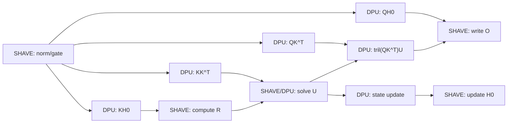

# NPU GatedDeltaNet 异步并行可行性分析

## 1. 文档目标

本文分析在 NPU `GatedDeltaNet`（GDN）kernel 中实现异步并行的可行性，重点回答：

1. 当前实现为什么没有充分重叠 DPU 与 SHAVE；
2. 哪些计算可以并行，哪些必须串行；
3. 如何用 `dpuMatMulRun()` / `dpuMatMulWait()` 保证正确同步；
4. 如何分阶段实现，避免一开始引入复杂的多 workload 和跨 chunk 流水；
5. 需要修改哪些代码、验证哪些场景，以及何时应停止继续投入。

本文重点讨论 prefill（$S>1$）。`S=1` 已分派到专用 `gated_delta_net_s1` kernel，chunk 内三角求解和流水对 decode token rate 基本没有直接帮助。

## 2. 结论摘要

### 2.1 总体结论

在现有软件接口上实现 **单个 DPU workload 与 SHAVE 计算重叠** 是可行的，风险可控，建议实施。

主要依据：

- `dpuMatMulRun()` 与 `dpuMatMulWait()` 已经分离；
- `drvDpuStart()` 向 DPU FIFO 提交 descriptor 后立即返回；
- `drvDpuWait()` 通过轮询 workload completion 字段等待完成；
- Attention kernel 已采用相同 API，在 DPU 运行期间执行 softmax、DMA 配置等 SHAVE 工作；
- GDN 中至少存在两组依赖清晰且 buffer 不冲突的重叠机会。

推荐优先实现：

1. `QK^T` DPU MatMul 与 SHAVE `R` 计算重叠；
2. state-update DPU MatMul 与 SHAVE output 写回重叠；
3. `KK^T` DPU MatMul 与 Q/state FP16 staging 重叠。

跨 chunk 的 DMA ping-pong 也具有可行性，但需要新增 buffer、DMA descriptor 和生命周期协议，CMX 压力更高，应作为第二阶段独立评估。

### 2.2 可行性等级

| 方案 | 软件可行性 | 风险 | 预期收益 | 建议 |
|---|---:|---:|---:|---|
| 单 DPU workload 与 SHAVE 重叠 | 高 | 低到中 | 中 | 首先实施 |
| chunk 内多个 DPU workload 同时在途 | 中 | 中到高 | 未知 | 暂不作为首版目标 |
| DMA、DPU、SHAVE 三方重叠 | 中 | 高 | 中到高 | 第二阶段原型 |
| 相邻 chunk 完整双缓冲 | 中 | 高 | 取决于 DDR 占比 | profile 后决定 |
| FlashQLA 式多 consumer 角色重构 | 低到中 | 很高 | 未知 | 不建议直接照搬 |

## 3. 当前实现

### 3.1 执行资源

GDN kernel 同时使用三类资源：

- **SHAVE**：控制流、Q/K L2Norm、gate、FP32/FP16 转换、decay、三角求解和输出拼装；
- **DPU**：规则的 FP16 MatMul；
- **CMX**：输入、输出、FP32 working buffer、FP16 DPU staging buffer、DPU descriptor 和 weight table。

当前每个 SHAVE 按 value-head 分工：

```cpp
for (size_t h_v = shaveId; h_v < v_H; h_v += numShaves) {
    // Each SHAVE processes independent value heads.
}
```

因此，不同 head 已经可以并行。但对同一 SHAVE 的同一 head/chunk，算法阶段按 C++ 语句顺序执行。

### 3.2 当前同步模式

GDN 的所有 DPU MatMul 当前使用同步封装：

```cpp
dpuMatMulRunW(params, output, inputA, inputB);
```

其语义是：

```cpp
dpuMatMulRun(params, output, inputA, inputB);
dpuMatMulWait(params);
```

所以当前时间线为：

```text
SHAVE 准备输入
    ↓
SHAVE 提交 DPU
    ↓
SHAVE 原地等待 DPU 完成
    ↓
SHAVE 执行后处理
```

这保证了正确性，但 DPU 工作期间没有利用当前 SHAVE 执行独立计算。

### 3.3 `run` 和 `wait` 的底层语义

`dpuMatMulRun()` 配置输入、权重和输出 CMX 地址，提交 descriptor：

```cpp
drvDpuStart(dpuDrvDescOffset(&params->variant),
            &params->stats.odu_workload_duration);
```

`drvDpuStart()` 将 completion 字段清零，然后向 DPU FIFO 写入 descriptor offset。

`dpuMatMulWait()` 最终调用：

```cpp
while (*workDuration == 0) {
    __asm volatile("NOP 1" ::: "memory");
}
```

因此 `wait` 是当前 SHAVE 上的忙等同步点。它等待 DPU 写回 completion 状态，不是主机线程同步，也不是编译器自动推导的数据依赖。

相关代码：

- DPU MatMul run/wait：`sw_runtime_kernels/kernels/inc/dpu_shave_matmul.hpp`
- DPU driver start/wait：`sw_runtime_kernels/kernels/inc/dpu_drv.hpp`
- GDN kernel：`sw_runtime_kernels/kernels/src/gated_delta_net.cpp`

## 4. GDN 算法依赖

对一个长度为 $C\le64$ 的 chunk，定义：

$$
Q,K\in\mathbb{R}^{C\times D},\quad
V,U,R\in\mathbb{R}^{C\times D_v},\quad
H_0\in\mathbb{R}^{D\times D_v}
$$

主要阶段为：

1. SHAVE：Q/K L2Norm、gate 和累计 decay；
2. DPU：$KK^T$；
3. SHAVE：将 causal decay 折叠进 $KK^T$；
4. DPU：$KH_0$，得到 `s0k`；
5. DPU：$QH_0$，得到 `s0q`；
6. DPU：$QK^T$；
7. SHAVE：$R=\beta(V-\gamma\odot s0k)$；
8. SHAVE/DPU：求解下三角系统 $LU=R$；
9. DPU：$O_{intra}=\operatorname{tril}(QK^T)U$；
10. SHAVE：$O=\gamma\odot s0q+O_{intra}$；
11. DPU：$\Delta H=K^T(E\odot U)$；
12. SHAVE：$H_C=\gamma_CH_0+\Delta H$。



图中的箭头是必须满足的真实数据依赖。没有直接依赖且 buffer 不冲突的节点可以重叠。

## 5. 首选异步方案

### 5.1 方案 A：`QK^T` 与 `R` 重叠

数学上：

$$
QK^T\quad\text{与}\quad R=\beta(V-\gamma\odot s0k)
$$

彼此独立。`R` 只依赖已经完成的 `s0k`，不依赖 `QKtH16`。

当前逻辑：

```cpp
dpuMatMulRunW(mmParams, QKtH16, QnH16, KnH16);
foldDecayIntoQKt();
computeR();
```

建议逻辑：

```cpp
dpuMatMulRun(mmParams, QKtH16, QnH16, KnH16);

// Independent SHAVE work while DPU computes QK^T.
computeR();

dpuMatMulWait(mmParams);
foldDecayIntoQKt();
```

从 `run` 到 `wait` 之间：

- `QnH16`、`KnH16`：DPU 输入，不得覆盖；
- `QKtH16`：DPU 输出，不得读取或写入；
- `mmParams`：descriptor/status，不得修改或复用；
- `R`、`V`、`s0kH16`、`gamma`、`beta_c`：不与上述对象冲突，可以访问。

这是第一优先级实验，因为代码改动小、依赖清晰，且 `computeR` 有 $C\times D_v$ 个 FP32 元素操作，可形成实际重叠窗口。

### 5.2 方案 B：state-update 与 output 写回重叠

当 `intraH16` 和 `U` 已准备完成后：

$$
O=\gamma\odot s0q+O_{intra}
$$

与：

$$
\Delta H=K^T(E\odot U)
$$

彼此独立。

建议顺序：

```cpp
prepareStateUpdateInputs(Knt, UEt, Kn, U, Erat);
dpuMatMulRun(mmParams3, stateOutH16, UEt, Knt);

// Does not consume stateOutH16 or overwrite Knt/UEt.
writeOutput(oData, gamma, s0qH16, intraH16);

dpuMatMulWait(mmParams3);
updateH0T(H0T, stateOutH16, gammaLast);
```

该方案的重叠窗口是 $C\times D_v$ 的 output scale-add 和类型化 store。

### 5.3 方案 C：`KK^T` 与 FP16 staging 重叠

启动 $KK^T$ 后，可准备不冲突的 `QnH16` 和 `H0TH16`：

```cpp
stageToF16(KnH16, Kn, cc * D);
dpuMatMulRun(mmParams, KKtH16, KnH16, KnH16);

stageToF16(QnH16, Qn, cc * D);
stageToF16(H0TH16, H0T, Dv * D);

dpuMatMulWait(mmParams);
foldDecayIntoKKt();
```

这个方案正确性的前提是 `H0TH16` 在 DPU 计算 $KK^T$ 时没有被其他任务使用。当前顺序下满足该条件，但实现时仍应通过 buffer-lifetime 表逐项审查。

## 6. 同步协议

### 6.1 基本规则

异步化后使用以下规则决定 `wait` 的位置：

> 在第一次读取 DPU 输出、覆盖 DPU 输入、修改 descriptor，或开始依赖该输出的计算之前，等待对应 workload 完成。

每个在途 workload 的生命周期为：

```text
prepare inputs
    ↓
run(params, output, inputA, inputB)
    ↓
inputs/output/params frozen
    ↓
independent SHAVE work
    ↓
wait(params)
    ↓
inputs/output/params reusable
```

### 6.2 Buffer 状态

建议在代码评审和调试版本中按以下状态理解每个 buffer：

| 状态 | 含义 | 允许操作 |
|---|---|---|
| FREE | 没有异步任务引用 | 可读写、可复用 |
| DPU_READ | DPU 正在读取输入 | SHAVE 不得覆盖 |
| DPU_WRITE | DPU 正在生成输出 | SHAVE 不得读写 |
| READY | DPU 已完成，尚未消费 | SHAVE 可读取 |

首版不必实现通用状态机；保持结构化的 `run → independent work → wait → consume` 即可。但应为每个异步区间维护书面的 buffer-lifetime 表。

### 6.3 异常和提前返回

一旦 `run` 成功提交，任何控制流在离开当前 scope 前都必须执行对应 `wait`。首版异步区间中不应包含：

- `return`；
- 可能跳出 chunk/head 循环的 `break`；
- 可能绕过 `wait` 的条件分支。

当前 kernel 不使用 C++ 异常，因此主要风险是后续维护引入提前退出。

### 6.4 Descriptor 复用

`DpuParamsBuffers` 内含 descriptor 和 completion 字段。对应 workload 完成前：

- 不得重新调用 `setupDpuMatMul()`；
- 不得用同一个 params 启动另一任务；
- 不得清零或复用其 stats 字段。

GDN 已为不同 MatMul shape 分配多份 params，这有利于清晰管理生命周期。

## 7. 多 SHAVE 与 DPU 争用

### 7.1 现状

每个 SHAVE 独立处理 value head，并拥有独立 scratch、DPU params 和 staging buffer。因此内存上不存在跨 SHAVE descriptor 复用。

但是多个 SHAVE 可能同时向同一 tile 的 DPU FIFO 提交 workload。当前同步版本也存在这种可能，只是每个 SHAVE 提交后立即等待。

### 7.2 首版边界

建议首版遵守：

- 每个 SHAVE 任意时刻最多一个 outstanding DPU workload；
- 不为了增加 DPU 并行而连续提交两个 GDN MatMul；
- 只将当前 SHAVE 的独立计算移动到 `run` 和 `wait` 之间；
- 不改变 head 到 SHAVE 的分配方式。

这样不会增加单个 SHAVE 的 DPU queue depth，只会推迟 wait。

### 7.3 已有平台先例

Attention kernel 已使用分离的 `run/wait`，并在 DPU 运行期间执行 softmax、归一化或 DMA 配置：

- Attention pipeline：`sw_runtime_kernels/kernels/src/attention.cpp`
- Flash Attention DMA pipeline：`sw_runtime_kernels/kernels/src/attention_dma_flash.cpp`

这证明 NPU 软件栈支持延迟等待，也提供了代码组织参考。但它不能替代 GDN 多 SHAVE/head 场景的硬件验证。

## 8. 第二阶段：DMA、DPU、SHAVE 三方流水

### 8.1 目标

在处理 chunk $i$ 时预取 chunk $i+1$：

```text
DMA:                load chunk 1   load chunk 2
DPU:      matmul chunk 0  matmul chunk 1
SHAVE:    scalar chunk 0  scalar chunk 1
```

需要两套输入 stage：

```text
stage A：当前 chunk 正在消费
stage B：下一 chunk 正在加载/准备
```

### 8.2 与 FlashQLA 的对应关系

FlashQLA 使用双缓冲 shared memory：

```python
q_shared = T.alloc_shared((2, block_S, DK), ...)
k_shared = T.alloc_shared((2, block_S, DK), ...)
```

并用 `data_is_ready` / `data_is_free` barrier 管理生产者和消费者：

- `data_is_ready`：输入已经加载完成，可以计算；
- `data_is_free`：所有消费者已完成，可以覆盖该 stage。

参考 FlashQLA 中的 `flash_qla/ops/gated_delta_rule/chunk/hopper/fused_fwd.py`。

NPU 上对应为 DMA event/descriptor 和显式 buffer ownership，而不是 CUDA warpgroup barrier。

### 8.3 主要障碍

1. 当前 GDN scratch 已按每个 SHAVE 复制，新增完整双缓冲可能显著增加 CMX；
2. `Kn/Qn/KKt/QKt` 等中间量并非都需要双份，应只复制跨 chunk 预取所需的最小集合；
3. 下一个 chunk 的 `KH_0` 和 `QH_0` 依赖当前 chunk 的最终状态，不能提前执行；
4. 可以提前做的工作主要是输入 DMA、Q/K normalization、gate 和与状态无关的 Gram MatMul；
5. SHAVE 在准备下一 chunk 时不能覆盖当前 DPU 仍在读取的 staging buffer。

因此第二阶段应先尝试“输入 DMA 双缓冲”，不要直接复制全部 FP32/FP16 scratch。

## 9. 不可并行的关键路径

下列依赖不能通过简单移动 `wait` 消除：

### 9.1 三角求解内部

$$
U_t=R_t-\beta_t\sum_{i=0}^{t-1}L_{t,i}U_i
$$

$U_t$ 依赖所有更早的 $U_i$。当前实现中每个 32-row block 内必须按行 forward substitution。

### 9.2 相邻 chunk 的状态传递

$$
H_0^{(c+1)}=H_C^{(c)}
$$

下一个 chunk 的 state-dependent MatMul 必须等待当前 chunk 状态更新完成。

### 9.3 DPU 输出消费

例如 decay folding 读取 `QKtH16`，必须位于对应 `dpuMatMulWait()` 之后。C++ 代码顺序和 `volatile` completion 轮询共同形成同步，不能依赖“通常 DPU 已经算完”的时间假设。

## 10. 实施计划

### Phase 0：建立基线

目标：确认瓶颈和可隐藏时间，不修改算法。

采集：

- kernel 总周期；
- 每类 DPU MatMul 的 duration；
- SHAVE 在各阶段的周期；
- DPU wait 占比；
- 不同 $S,D,D_v,H_v$ 的结果；
- 单 cluster 与 multi-cluster；
- 1、2、更多 active SHAVE 场景。

建议基准 shape：

| 用途 | $S$ | $H_q/H_v$ | $D/D_v$ |
|---|---:|---:|---:|
| 小规模正确性 | 8, 16, 48 | 2/2, 2/4 | 16/16 |
| 单 chunk | 64 | 4/8, 16/16 | 32/32, 128/128 |
| 多 chunk | 128, 256, 512 | 16/16 | 128/128 |
| GQA | 512 | 6/12, 16/32 | 128/128 |

### Phase 1：一个异步窗口

只实现：

```text
DPU QK^T || SHAVE compute R
```

验收：

- 所有现有 GDN functional test 通过；
- 数值误差相对同步版本无显著变化；
- kernel profile 显示 wait 时间下降或总周期下降；
- 多 SHAVE、多 cluster 无 hang；
- 对短序列没有显著回退。

### Phase 2：增加两个安全窗口

加入：

```text
DPU KK^T         || SHAVE stage Q/H0
DPU state update || SHAVE write output
```

每增加一个窗口，都单独测量增量收益，避免多个改动混在一起无法定位问题。

### Phase 3：调度和 shape 选择

异步开销对小 shape 可能得不偿失，可根据 profile 增加静态分支：

```text
大 C/D/Dv：异步路径
小 C/D/Dv：保留同步 RunW 路径
S=1：专用 decode kernel
```

在建立 cycle-cost 数据前，不建议凭经验固定阈值。

### Phase 4：DMA ping-pong 原型

仅在 Phase 1/2 已证明 DPU/SHAVE overlap 有收益，并且 profile 显示 DDR/DMA 占比仍高时进入。

首个原型只双缓冲原始 Q/K/V/gate/beta 输入，状态和大部分工作区保持单份。

## 11. 预计代码改动

### 11.1 Runtime kernel

主要文件：

- `sw_runtime_kernels/kernels/src/gated_delta_net.cpp`
- 必要时复用 `sw_runtime_kernels/kernels/inc/dpu_shave_matmul.hpp`

首版不需要修改 compiler IR、op schema 或 kernel 参数。

建议先把较长的 SHAVE 循环提取为局部 helper，以清晰表达：

```text
prepare → run → independent work → wait → consume
```

但应避免与异步化无关的大规模重构。

### 11.2 Compiler scratch

Phase 1/2 复用现有 buffer，不增加 scratch，compiler 侧理论上无需改变。

Phase 4 若新增 ping-pong buffer，需要同步修改：

- `getAuxiliaryBufferType()` 的 scratch 大小计算；
- kernel scratch carving；
- CMX fit 和 sequence split 行为；
- lit test 中可能受影响的 tiling/split 预期。

当前 scratch 计算见 `src/vpux_compiler/src/dialect/VPU/IR/ops/gated_delta_net.cpp`。

## 12. 验证方案

### 12.1 正确性

至少覆盖：

- FP16 和 FP32 输入/输出；
- fused/non-fused Q/K L2Norm；
- $C<32$、$C=32$、$32<C<64$、$C=64$；
- 尾 chunk 非 16 对齐；
- $D\ne D_v$；
- GQA；
- 多 head、多 SHAVE、多 cluster；
- 多 chunk 状态连续传递；
- sequence split 后的多个 GDN op；
- NPU50XX 和可用的 NPU60XX。

现有测试入口为 `tests/functional/single_layer_tests/gated_delta_net.cpp`。

建议额外增加同步/异步 A/B debug 开关，在完全相同输入上直接比较：

```text
output
final recurrent state
```

### 12.2 稳定性

重点检测异步错误的非确定性特征：

- 同一输入重复运行 100 到 1000 次；
- 改变 active SHAVE 数；
- 改变 head 数和 cluster 数；
- 连续运行多个 GDN layer；
- 输出偶发差异、hang、completion 不返回和 descriptor 污染。

### 12.3 性能

报告以下指标，而不只看端到端时间：

- GDN kernel latency；
- DPU workload 总时长；
- SHAVE busy time；
- `drvDpuWait()` 累计周期；
- overlap 前后的关键路径长度；
- CMX 使用量；
- prefill token/s；
- 整模型 TTFT。

理想情况：DPU duration 基本不变，SHAVE 工作量基本不变，但总 kernel latency 和 wait 累计周期下降。

## 13. 风险与缓解

| 风险 | 现象 | 缓解方式 |
|---|---|---|
| DPU 输入被提前覆盖 | 随机 accuracy error | 明确 run/wait 间冻结的 buffer |
| DPU 输出被提前读取 | 偶发旧值/部分结果 | 第一次消费前强制 wait |
| params 提前复用 | hang 或错误 workload | 每个在途任务独占 params |
| 多 SHAVE FIFO 竞争 | 性能回退或长尾 | 从单 outstanding/SHAVE 开始，覆盖多 head 测试 |
| 可隐藏工作太短 | 收益接近零 | profile 后按 shape 保留同步路径 |
| helper 重构改变数值顺序 | accuracy 漂移 | 首版只移动独立 block，不改内部算术顺序 |
| 双缓冲增加 CMX | 更多 sequence split | Phase 4 单独评估 CMX 与 DDR 收益 |
| busy-wait 仍占 SHAVE | overlap 不充分 | 尽量把足够长的真实工作放在 run/wait 之间 |

## 14. Go/No-Go 标准

### Phase 1 继续推进条件

满足全部条件：

- 正确性测试全部通过；
- 重复运行无非确定性错误或 hang；
- Qwen-scale GDN kernel latency 有稳定改善；
- multi-SHAVE 场景无系统性回退；
- 不增加 scratch/CMX。

### 停止或回退条件

出现任一情况应停止扩展异步窗口：

- DPU wait 后仍出现不可解释的数据一致性问题；
- 多 SHAVE 场景因 FIFO contention 明显变慢；
- 主要 shape 的收益低于测量噪声；
- 小 shape 回退无法通过简单策略选择规避；
- DMA 双缓冲导致 sequence split 增加，抵消局部 kernel 收益。

## 15. 最终建议

推荐先实现最小原型：

```text
dpuMatMulRun(QK^T)
    ||
SHAVE compute R
    ↓
dpuMatMulWait(QK^T)
```

它具有以下优点：

- 不改变算法；
- 不改变 compiler IR；
- 不增加 scratch；
- 不需要多个 DPU workload 同时在途；
- 数据依赖和 buffer ownership 清晰；
- 可以直接复用 Attention kernel 已验证的 run/wait 编程模式。

如果该原型不能在 Qwen-scale shape 上产生稳定收益，则不应直接投入更复杂的 FlashQLA 式 producer-consumer 重构。若原型有效，再依次增加 state-update/output 重叠和 `KK^T`/staging 重叠，最后根据 DDR profile 决定是否引入跨 chunk DMA ping-pong。
